# 题目描述
### A．虫口模型与Logistic映射

1．对于迭代方程

$$
x_{n+1}=1-\mu x_n^2
$$


分析不同的 $\mu \in(0,2)$ 下 $x_n$ 的长时间行为，以及其与初值 $x_0 \in(-1,1)$ 的关系。（2分）

2．将上述的方程换成

$$
x_{n+1}=\cos x-\mu x_n^2
$$


合理选择 $\mu, x_0$ 的区间，并分析 $x_n$ 的长时间行为。（1分）
3．比较两种情况，你发现了什么？（1分）

### B．开心消消乐

在一个 $L \times L$ 的网格（即每行每列均有 $L$ 个格子）上定义如下的消消乐游戏：
1．在最开始，格子上没有任何的方块。
2．每次挑选任意一个格子，放上去一个方块。每放上去一个方块，系统开始演化一个时间步。一个时间步内的演化规则见后面一条。
3．如果一个格子上的方块数目大于等于 4 ，则消去 4 个方块，并记录一次消去，这四个方块会移动累加到上下左右的 4 个格点（它们各自方块数 +1 ），（如果有一个方块的两个邻居同时消去并给到它，则它的方块数量 +2 ，也就是说影响是叠加的；考虑开放边界条件，即如果一个格子在边界发生消去，则有一个或者两个方块移动出去了）。每次同时消去所有当前高度大于等于 4 的格子，并记录下总的消去次数。直到场上没有任何格子的方块数 $\geq 4$ ，这一个时间步结束。
4．每一步的得分 $s$ 即为这一步的总消去次数。


1. 选取网格大小 $L=32$ ，演化足够多的时间步，并记录网格平均方块密度 $n$（ $n=\frac{N}{L^2}$ ，其中 $N$ 是场上的方块总数）随着演化时间 $t$ 的关系。你发现了什么？（2分）
2. 选取并固定一个合适的系统尺寸 $L$（取决于你的计算能力），统计长时间演化时，每步得分的频率分布 $P(s)$ 。你发现了什么规律？（2分）
3. 选取多个不同的系统尺寸 $L$ 重复（2）的过程，验证你发现的统计规律。系统的尺寸对这一规律有什么影响？（1分）
4. 你能解释你在（B）中发现的规律吗？有什么别的思考？（1分）

# 算法浅析
### A．虫口模型与Logistic映射
本题目考察了迭代方程和Logistic映射的一些性质。该题所用算法简单，将$x_n$的值代入方程，得到新的$x_{n+1}$值，重复这一过程，即可得到$x_n$的序列。

具体来说，本程序通过`logistic_map`重复这一过程，并将$x_n$序列的值输出。

### B．开心消消乐
本题的实现关键在于如何快速找到大于等于4的格子，也即需要消去的格子。

在`B.py`中，我们使用了一个`numpy`数组来表示网格，并在`exist_4_or_more`对x,y坐标进行检索，找到大于等于4的格子。

在`B_tree.py`中，我使用深度搜索(BFS)的方法进行搜索，找到大于等于4的格子。伪代码如下：

```python
def find_4_or_more(L,gridll,x,y,s):
    if gridll[x][y] < 4:    
        return 
    if gridll[x][y] >=4 :
        delete_block(L,gridll,x,y)
        s[0] += 1
        if x >=1:
            find_4_or_more(L,gridll,x-1,y,s)
        if x < L-1: 
            find_4_or_more(L,gridll,x+1,y,s)
        if y >=1:
            find_4_or_more(L,gridll,x,y-1,s)
        if y < L-1:
            find_4_or_more(L,gridll,x,y+1,s) 
```

# 项目结构
```
.
├── README.md
├── code
│   ├── A_1.py 对应第一个迭代方程
│   ├── A_2.py 对应第一个迭代方程
│   ├── B.py  B题的普通算法
│   ├── B_tree.py  使用深度有限搜索的B题算法
├── figure png文件

```

# 结果及分析
### A．虫口模型与Logistic映射
####  迭代方程一（$x_{n+1}=1-\mu x_n^2$）
##### 不同的$\mu$下$x_n$的长时间行为
不妨选取$x_0=0.5$，选取$\mu=0.01，0.3，0.6, 1, 1.3, 1.6，1.99$，画出$x_n$的长时间行为。代码运行结果如下：
 

由上图可以看出，当$\mu$接近于0时，$x_n$迅速收敛于1，保持稳定；当$\mu$较小的时候，$x_n$也可以迅速收敛到一个稳定值；随着$\mu$的增大，$x_n$的收敛速度变慢；当$\mu$等于1时，$x_n$规律地在0和1之间震荡；当$\mu$继续增大的同时，$x_n$的波动幅度变大，由规律振荡过渡为无规律性、无周期性的振荡；当$\mu$接近于2时，$x_n$的振荡幅度变得很大，且呈现出混沌性。
##### $x_0$的影响
不妨选取不同的$x_0$，画出$x_n$的长时间行为，研究其与$x_0$初值的关系：

$x_0=-0.99$:
 


$x_0=-0.5$:
 

$x_0=0$:
 

$x_0=0.5$:


$x_0=0.99$:
 

综合以上结果，我们发现对于不同的$x-0$取值，$\mu$的对于$x-n$的长时间行为是的影响是一致的，具体分析来说：

当$\mu$接近于0时，$x_n$迅速收敛于1，保持稳定；随着$\mu$的增大，$x_n$迅速收敛到一个稳定值，且$x_0$越大，$x_n$的稳定解越小，收敛到稳定值的速度越慢；当$\mu$等于1时，$x_n$逐渐过渡到规律地在0和1之间震荡；当$\mu$继续增大的同时，$x_n$的波动幅度变大，由规律振荡过渡为无规律性、无周期性的振荡；当$\mu$接近于2时，$x_n$的振荡幅度变得很大，且呈现出混沌性。

进一步地，对于$z_n$收敛于不动点以及混沌体系这两种情况进一步研究：
###### 探究不动点

不妨取$\mu=0.5$,取$x_0 = [-0.8,-0.6,-0.4,-0.2,0,0.2,0.4,0.6,0.8]$,探究不同的$x_0$下$x_n$的长时间行为是否收敛以及收敛值的关系。

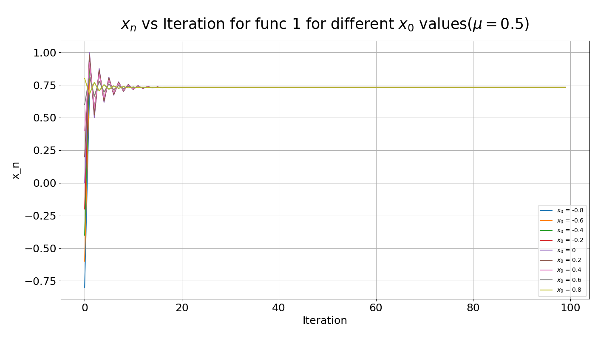 

由上图可以发现:
- 当$x_0$取值在$[-0.8,0.8]$时，$x_n$的长时间行为是收敛的，且收敛值与$x_0$的大小无关。
- $x_0$的绝对值越接近不动点，$x_n$的振荡幅度越小，收敛速度越快；


而这也是直观的:
- 当$x_n$的值能够稳定振荡时,$x_n$的取值其实是方程的不动点，与初值无关。
- $x_n$越接近不动点，越容易达到稳定。


###### 探究混沌体系

不妨取$\mu=1.5$,取$x_0 = [-0.8,-0.6,-0.4,-0.2,0,0.2,0.4,0.6,0.8]$，探究不同的$x_0$下$x_n$的长时间混沌是否受到$\mu$的影响。

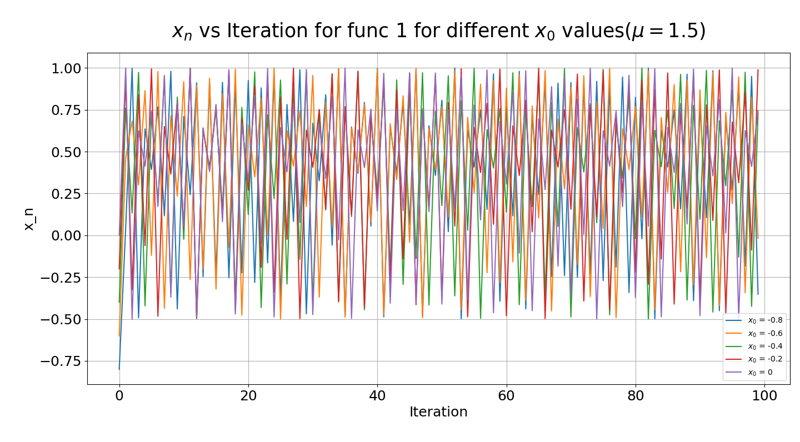 

由上图可以发现:

- 当$x_0$取值在$[-0.8,0.8]$时，$x_n$仍为混沌系统，这一混沌行为对于不同的$x_0$都存在。
- 对于$x_0$的不同取值，$x_n$的取值也随之有剧烈的不同，而且毫无规律可言。


####  迭代方程二（$x_{n+1}=\cos x-\mu x_n^2$）

不妨选取$x_0=0$，选取$\mu=0.01，0.3，0.6, 1, 1.3, 1.6，1.99$，画出$x_n$的长时间行为。代码运行结果如下：
 

由上图可以看出，当$\mu$接近于0时，$x_n$迅速收敛，保持稳定；随着$\mu$的增大，$x_n$保持周期性振荡；随着$\mu$的继续增大，当$\mu$接近于1时，$x_n$的显现出无周期性的混沌；当$\mu$继续增加时，$x_n$又重新显现出周期性；当$\mu$继续增大的同时，$x_n$不再收敛，迅速发散至负无穷。
##### $x_0$的影响
不妨选取不同的$x_0$，画出$x_n$的长时间行为，研究其与$x_0$初值的关系：

$x_0=-0.99$:
 

$x_0=-0.5$:
 

$x_0=0$:
 

$x_0=0.5$:


$x_0=0.99$:
 

综合以上结果，我们发现对于不同的$x_0$取值，以上得到的基本现象是一致的。具体来说：

当$\mu$接近于0时，$x_n$迅速收敛，保持稳定，系统受初值影响较小；随着$\mu$的增大，$x_n$保持周期性振荡，系统受初值影响较小；随着$\mu$的继续增大，当$\mu$接近于1时，$x_n$的显现出无周期性的混沌，系统受初值的剧烈影响，初值的不同会导致$x_n$的行为发生剧烈的变化；当$\mu$继续增加时，$x_n$又重新显现出周期性，系统受初值的影响较小；当$\mu$继续增大的同时，$x_n$不再收敛，迅速发散至负无穷。

进一步探究在不动点、混沌、发散几种情况下$x_0$对于$x_n$的影响：        

###### $x_0$对不动点的影响

不妨取$\mu=0.1$,取$x_0 = [-0.8,-0.6,-0.4,-0.2,0,0.2,0.4,0.6,0.8]$,探究$x_n$对不动点的影响。

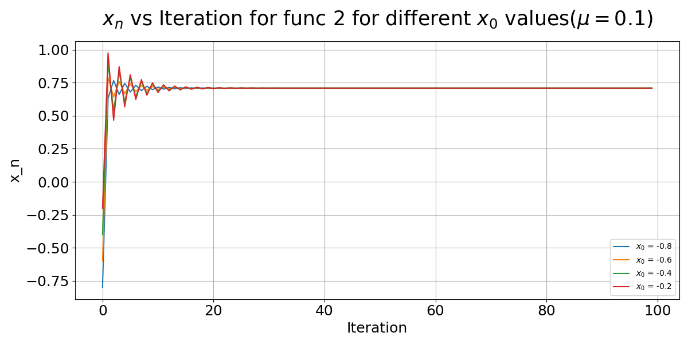 
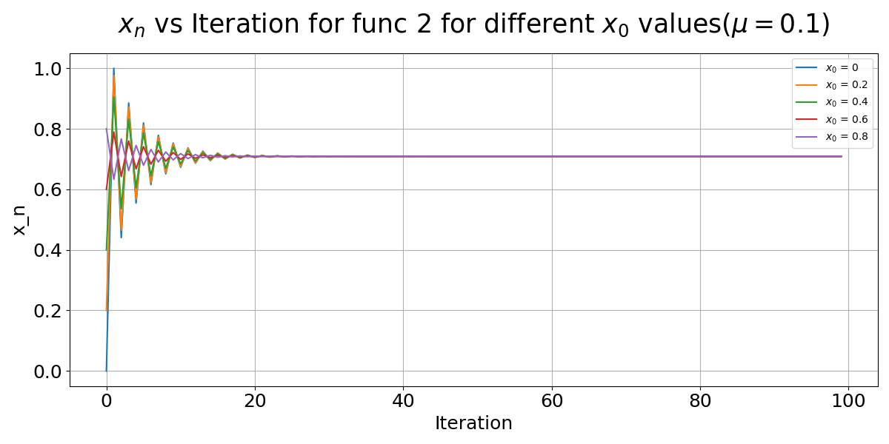 


由上图可以看出：


直观解释：
- 当$x_n$的值能够稳定振荡时,$x_n$的取值其实是方程的不动点，与初值无关。
- $x_n$越接近不动点，越容易达到稳定。

###### $x_0$对混沌的影响

不妨取$\mu=1.5$,取$x_0 = [-0.8,-0.6,-0.4,-0.2,0,0.2,0.4,0.6,0.8]$，探究$x_n$对混沌的影响。

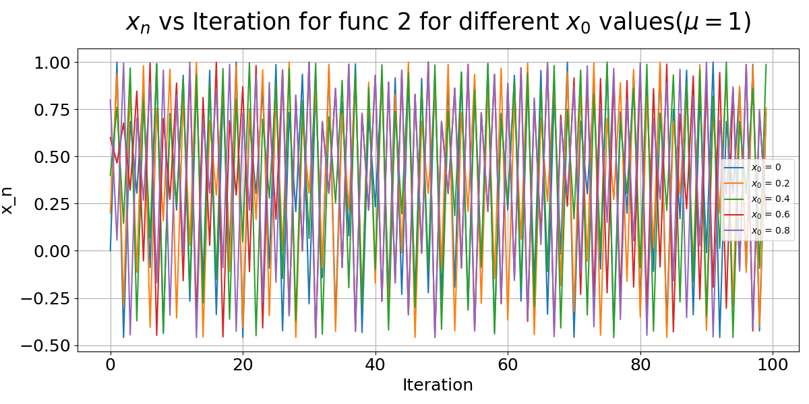 

由上图可以看出：

- 当$x_0$取值在$[-0.8,0.8]$时，$x_n$仍为混沌系统，这一混沌行为对于不同的$x_0$都存在。
- 对于$x_0$的不同取值，$x_n$的取值也随之有剧烈的不同，而且毫无规律可言。

<!-- ###### $x_0$对发散的影响

不妨取$\mu=1.6$,取$x_0 = [-0.8,-0.6,-0.4,-0.2,0,0.2,0.4,0.6,0.8]$，探究$x_n$对发散的影响。

 

由上图可以看出：

- 当$x_0$取值在$[-0.8,0.8]$时，$x_n$的长时间行为是发散的，且发散值与$x_0$的大小无关。 -->

####  比较

由以上结果可以发现，无论时哪种方程，都存在稳定振荡和混沌现象。

稳定点是由于方程的不动点产生的，而混沌现象下$x_n$取值不同是则是由于系统的初始条件不同导致的。

##### 比较两个方程的不动点 

###### 方程一
稳定情况即方程本身的不动点（不稳定解已舍去）：

$$
x=1-\mu x^2 \Leftrightarrow x=\frac{-1+\sqrt{1+4 \mu}}{2 \mu}
$$

事实上，另一个方程的解是不稳定点，因为
$$
x=1-\mu x^2 \Leftrightarrow x=\frac{-1-\sqrt{1+4 \mu}}{2 \mu}
$$

在不动点处的斜率为：

$$
x^{\prime}=-2 \mu x=1 \mp \sqrt{1+4 \mu}
$$

斜率大于1者稳定而小于1者不稳定，说明$$
x=1-\mu x^2 \Leftrightarrow x=\frac{-1-\sqrt{1+4 \mu}}{2 \mu}
$$是不稳定的解，不是方程的不动点。


###### 方程二
$x_{n}=\cos x-\mu x_n^2$是超越方程，没有解析形式的解。

定义$$g(x) = x-cos(x)-mux^2$$

令$g(x)=0$，$g'(x)=0$,即：
$$x-cos(x)+\mu x^2=0$$
$$1+sin(x)+2\mu x=0$$

得：
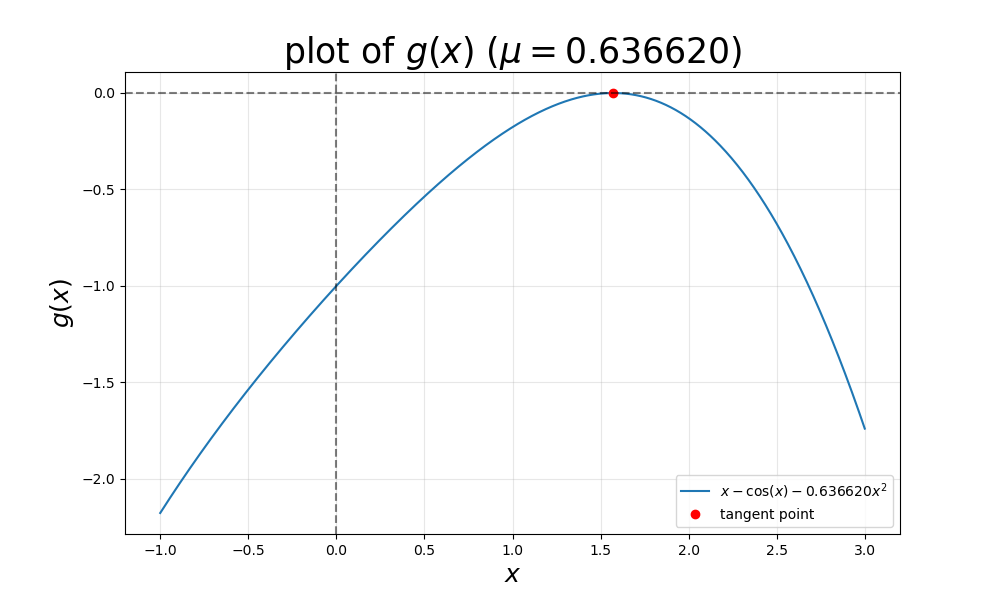 
由上图所示，当$\mu = 0.63662$时，方程二刚好有一个不动点。

而当$\mu $小于0.63662时，方程二的有一个不动点，当$\mu $大于0.63662时，方程二有两个不动点。

而对于有两个不动点的情况，以$\mu = 1$为例，做出方程二的图像：

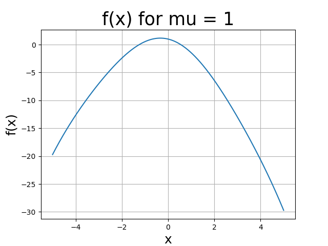 

由上图可以看出，只有较大的不动点为稳定的不动点

综上所述，方程一有一个稳定的不动点，方程二在不同的$\mu$下有不同数量的不动点，但稳定不动点的数量依然为1。

收敛于不动点的时候都有以下现象：
- 当$x_0$取值在$[-0.8,0.8]$时，$x_n$的长时间行为是收敛的，且收敛值与$x_0$的大小无关。
- $x_0$的绝对值越接近不动点，$x_n$的振荡幅度越小，收敛速度越快；

##### 对二者混沌现象的比较：

由上述图像观察可知，方程一的不动点左侧会逐渐过渡到混沌的状态，方程二的不动点右侧都会出现混沌的现象。

在混沌状态下，两个方程都存在以下现象：
- 当$x_0$取值在$[-1,1]$时，$x_n$仍为混沌系统，这一混沌行为对于不同的$x_0$都存在。
- 对于$x_0$的不同取值，$x_n$的取值也随之有剧烈的不同，而且毫无规律可言。

##### 发散情况

对于方程二，在$\mu$接近-1时，方程二的解会发散到负无穷。而在方程一中不会出现这样发散的情况


### B.开心消消乐

#### 1. 运行代码，得到网格平均方块密度 $n$随着演化时间 $t$ 的关系：

 

由上图可以看出，初始网格密度线性增长。为了进一步探究增加速度的大小，我对于前期平均密度随时间的变化进行一个拟合，得到拟合结果如下图：

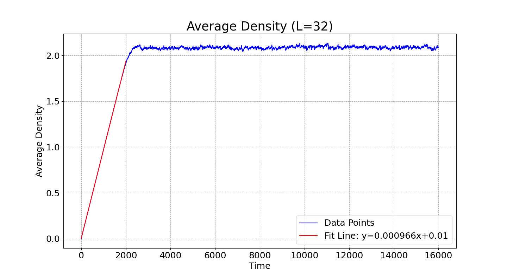 

图中说明前期图线的斜率为$9.66\times10^{-4}$,

而$1/32^2 = 9.765623e-4$

说明前期平均密度的增加速度约为$1/L^2$，这说明初始时刻在边缘“溢出”的格子较少，当然前期也不排除有方块在边界溢出，所以增加速度略小于$1/L^2$。


随着时间的推移，网格密度逐渐维持在一个稳定的值，约为2.1左右，这说明随机增加效应和边缘溢出效应达到了某种程度上的平衡。

#### 2. 统计长时间演化时，每步得分的频率分布 $P(s)$ 。代码运行结果如下：

 


由上图可以看出，得分频率在分数低的时候概率高，随着分数的增加概率迅速降低。

为了进一步探究得分分布的规律，我对于得分分布取对数并进行拟合,得到拟合结果如下图：

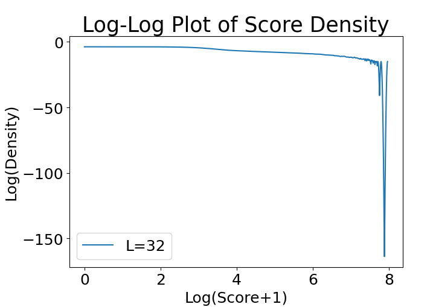 

由上图可以看出，当得分较小的时候，得分与得分频率间存在幂律关系；当得分大于$e^6$时，得分与得分频率脱离幂律且向下弯曲。

进一步地，对得分较小的情况进行线性拟合：


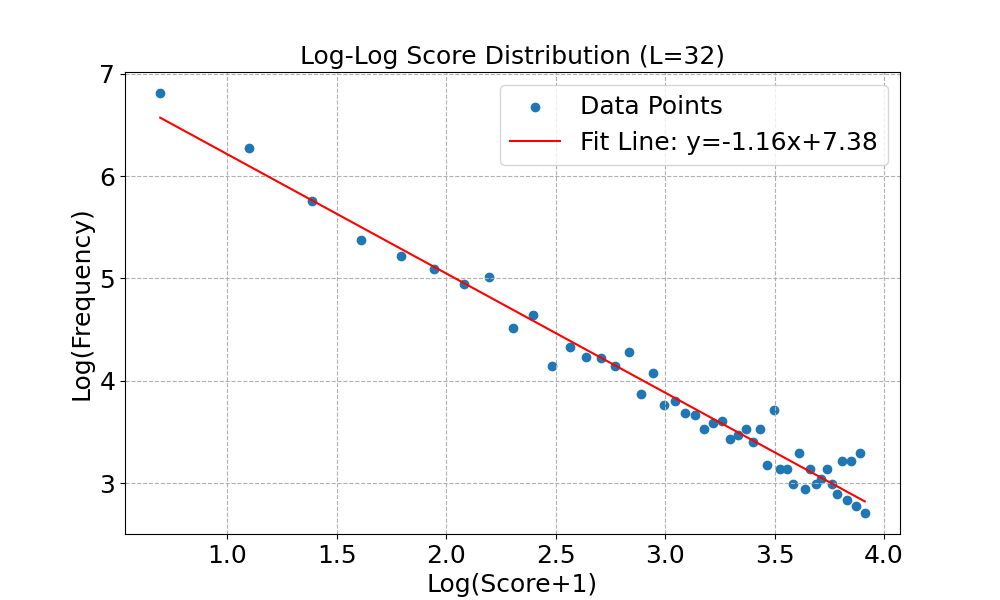 


由上图可以看出，得分与得分频率之间存在幂律关系，在双对数图下的斜率是-1.16。

由该拟合结果可以推出得分较小的时候，得分概率与得分的关系为:

$p = 2059(s+1)^{-1.16}$

由此可以看出，随着得分的增加，得分概率逐渐降低。

#### 3. 选取多个不同的系统尺寸 $L$ 重复（2）的过程

不妨选取$L=[30,35,40，45]$，运行代码，得到得分的概率分布随着系统尺寸的变化：


$L=30$：
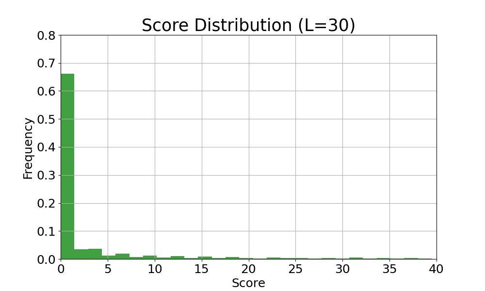 


$L=35$：
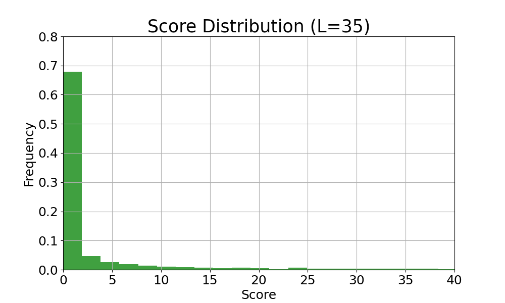 


$L=40$：
 


$L=45$:
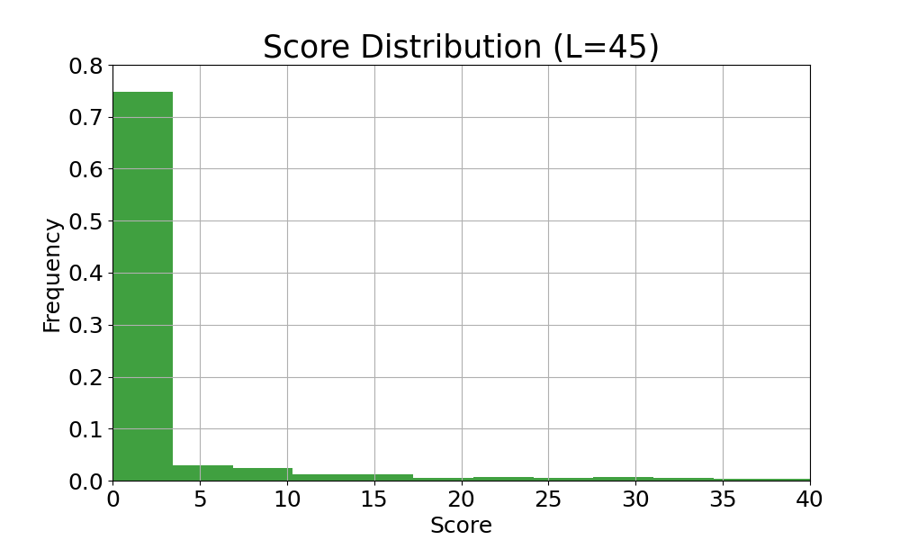


研究不同尺度下得分概率与得分的关系：
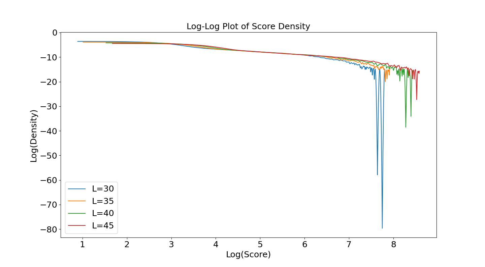 

发现：
1. 上述得到的得分与得分概率的关系仍然成立，即得分较小的时候，得分概率与得分有幂律关系，得分较高时，得分与得分频率脱离幂律且向下弯曲。
2. 随着尺寸的增加，幂律适用的范围增大

进一步地，探究得分较小时双对数下得分概率与得分的关系：

$L=30$
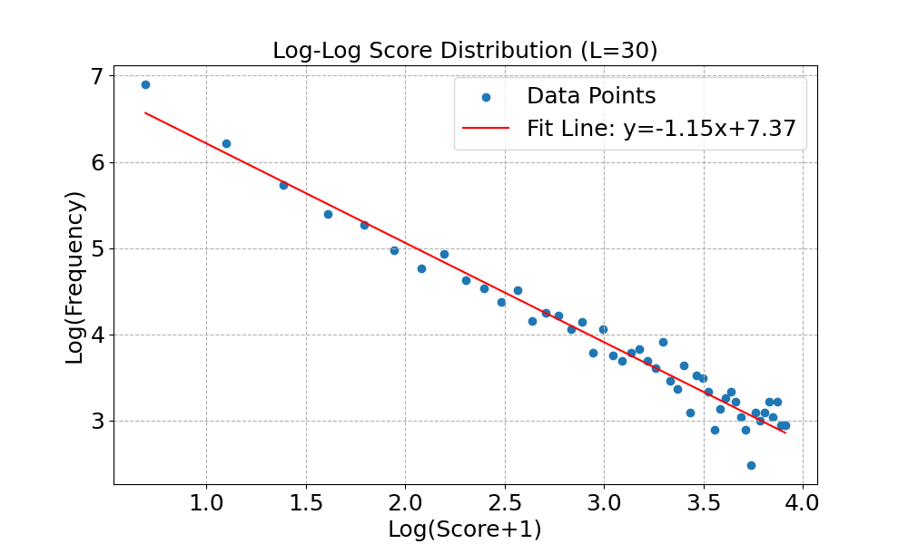 

$L=35$
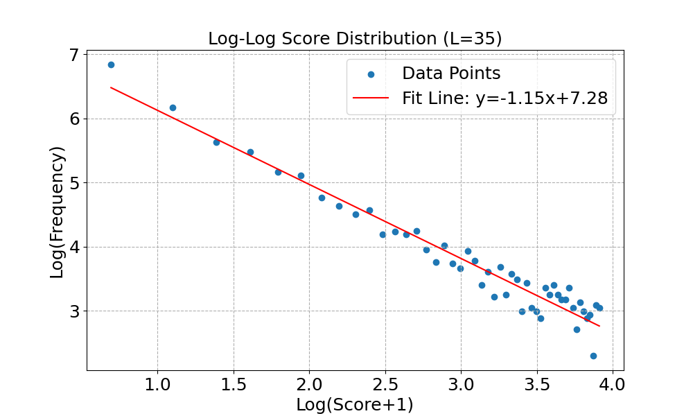 

$L=40$
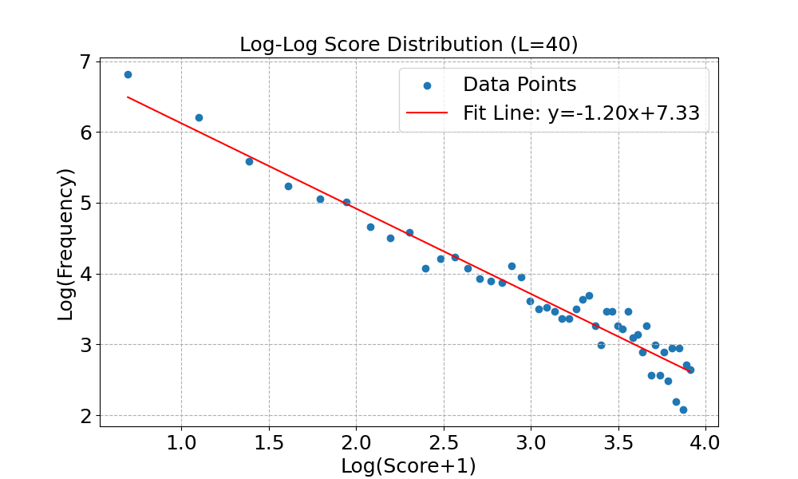 

$L=45$
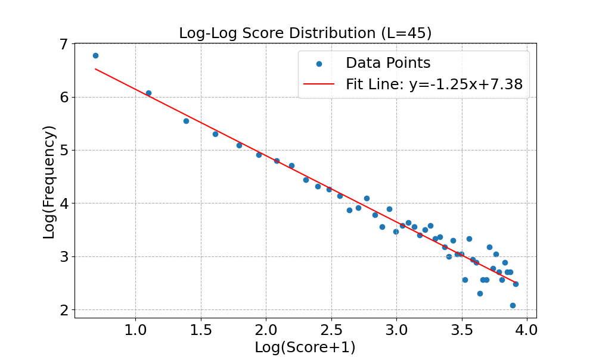 

由以上系列图片可以看出，log-log图的斜率均为-1.16左右，说明以上得到的公式$$p = 2059(s+1)^{-1.16}$$具有好的普适性。

此外，我统计了不同尺寸的网格在“消消乐”的过程中的最大得分，结果如下：

 

由上图可以看出，随着网格尺寸的增大，“消消乐”的最大得分越来越高，尤其是当网格尺寸达到40时，“消消乐”的最大得分达到3115。

综上所述，在不同尺度下，有以下三条结论：

1. 上述得到的得分与得分概率的关系仍然成立，即得分较小的时候，得分概率与得分有幂律关系，得分较高时，得分与得分频率脱离幂律且向下弯曲。
2. 随着尺寸的增加，幂律适用的范围增大
3. 随着网格尺寸的增大，“消消乐”的最大得分越来越高

#### 4. 对上述规律的解释

##### 1.脱离幂律的情况

利用反证，若幂律关系适用于任意大小的得分，则平均得分为：

$$\bar{s} = \sum_{i=1}^n s_iP_{s_i}$$

上述得到的幂律关系为：

$$p = 2059(s+1)^{-1.16}$$

则有：

$$\bar{s} = \sum_{i=1}^n s_iP_{s_i} = \sum_{i=1}^n 2059s_i(s_i+1)^{-1.16}$$

该种情况下的$\bar{s}$不收敛，但实际情形中尺度有限，得分的平均值不可能是无穷大，存在明显的矛盾。

由此，假设不成立，说明得分与得分频率的关系不可能一直符合幂律关系。

##### 2.幂律适用的范围增大

由上述的结果可以看出，随着尺寸的增加，最大得分增加，这可能是幂律适用的范围增大的原因。

##### 3.幂律为-1.16的原因

可以建立一个简单的模型来大概说明一下：

设不同格子的得分分布相同，得分为3的概率为$p_3$，则有：

$$p_{s_1} = p_3(1-p_3)^4$$

$$p_{s_2} = p_3(1-p_3)^3p_3(1-p_3)^3 = p_3^2(1-p_3)^6$$

$$p_{s_3} = p_3[(1-p_3)^2p_3^2(1-p_3)^6 + (1-p_3)^3p_3(1-p_3)^2P_3(1-p_3)^2] =2p_3^3(1-p_3)^8 $$

……

容易发现，随着时间的增加，当符合$p_3(1-p_3)^2 = \frac{1}{2}$时，恰好满足$$p_{s_2} = \frac{1}{2}p_{s_1}$$即得分为2的概率为得分为1的概率的一半。


以及$$p_{s_3} = \frac{1}{3}p_{s_1} $$即得分为3的概率为得分为1的概率的1/3。

以此类推，得分概率随得分的变化接近反比关系，与上述得到的结论一致。


# 附录：源码
### A_1.py


```python
import numpy as np
import matplotlib.pyplot as plt

def f_1(mu,x):
    """
    定义第一问中的迭代方程
    """
    return 1-mu*x**2

def logistic_map(x0, mu, n_iter)->np.ndarray:  
    """
    表示映射的迭代函数。
    输入三个参数，输出各代的x值。

    参数设置:
        x0: 初值，(0, 1) 区间内的浮点数。
        mu: 参数，(0, 4) 区间内的浮点数。
        n_iter: 迭代次数。

    Returns:
        一个包含迭代结果的 NumPy 数组。
    """
    x = np.zeros(n_iter)
    x[0] = x0
    for i in range(n_iter - 1):
        x[i+1] = f_1(mu, x[i])
    return x

# def plot_logistic_map(mu_values, x0, n_iter):
#     """
#     绘制不同 mu 值下的 Logistic 映射结果。

#     Args:
#         mu_values: 一个包含多个 mu 值的列表或 NumPy 数组。
#         x0: 初值。
#         n_iter: 迭代次数。
#     """
#     plt.figure(figsize=(12, 6))
#     for mu in mu_values:
#         print
#         x = logistic_map(x0, mu, n_iter)
#         plt.plot(x, label=f"μ = {mu}")

#     plt.xlabel("Iteration")
#     plt.ylabel("x_n")
#     plt.title("Logistic Map")
#     plt.legend()
#     plt.grid(True)
#     plt.show()

def plot_logistic_map(mu_values, x0, n_iter):
    """
    绘制不同 mu 值下的 Logistic 映射结果。
    将不同mu值的结果画到不同的子图中
    """
    num_plots = len(mu_values)
    fig, axes = plt.subplots(num_plots, 1, figsize=(12, 6 * num_plots)) 

    print("debug")

    for i, mu in enumerate(mu_values):
        x = logistic_map(x0, mu, n_iter)
        axes[i].plot(x, label=f"μ = {mu}")
        axes[i].xaxis.set_tick_params(labelsize=18)
        axes[i].yaxis.set_tick_params(labelsize=18)
        axes[i].set_xlabel("Iteration",fontsize=18)
        axes[i].set_ylabel("x_n",fontsize=18)
        axes[i].grid(True)
        axes[i].legend()
        
    plt.title(f"$x_n$ vs Iteration for func 1 for different $\mu$ values, $x_0$ = {x0}", 
              fontsize=19, y=10.5)
    plt.tight_layout()  # Adjust subplot parameters for a tight layout.
    plt.show()

mu_values = [0.01,0.3,0.6,1,1.3,1.6,1.99] 
mu_values = [0.01,0.5,1,1.5,1.99]
x0 = 0.99
n_iter = 50

plot_logistic_map(mu_values, x0, n_iter)


def plot_initial_condition_sensitivity(mu, x0_1, x0_2, n_iter):
    """
    绘制 Logistic 映射的初值敏感性。
    """
    x1 = logistic_map(x0_1, mu, n_iter)
    x2 = logistic_map(x0_2, mu, n_iter)

    plt.figure(figsize=(12, 6))
    plt.plot(x1, label=f"x0 = {x0_1}")
    plt.plot(x2, label=f"x0 = {x0_2}")

    plt.xlabel("Iteration",fontsize=18)
    plt.ylabel("x_n",fontsize=18)
    plt.title(f"Logistic Map - Initial Condition Sensitivity (μ = {mu})")
    plt.legend()
    plt.grid(True)
    plt.show()


mu = 3.9 
x0_1 = 0.2
x0_2 = 0.2001 
n_iter = 100

# plot_initial_condition_sensitivity(mu, x0_1, x0_2, n_iter)


```

### A_2.py

```python
import numpy as np
import matplotlib.pyplot as plt

def f_2(mu,x):
    """
    定义第二问中的迭代方程
    """
    return np.cos(x) - mu*x**2

def logistic_map(x0, mu, n_iter)->np.ndarray:  
    """
    表示映射的迭代函数。
    输入三个参数，输出各代的x值。

    参数设置:
        x0: 初值，(0, 1) 区间内的浮点数。
        mu: 参数，(0, 4) 区间内的浮点数。
        n_iter: 迭代次数。

    Returns:
        一个包含迭代结果的 NumPy 数组。
    """
    x = np.zeros(n_iter)
    x[0] = x0
    for i in range(n_iter - 1):
        x[i+1] = f_2(mu, x[i])
    return x

# def plot_logistic_map(mu_values, x0, n_iter):
#     """
#     绘制不同 mu 值下的 Logistic 映射结果。

#     Args:
#         mu_values: 一个包含多个 mu 值的列表或 NumPy 数组。
#         x0: 初值。
#         n_iter: 迭代次数。
#     """
#     plt.figure(figsize=(12, 6))
#     for mu in mu_values:
#         print
#         x = logistic_map(x0, mu, n_iter)
#         plt.plot(x, label=f"μ = {mu}")

#     plt.xlabel("Iteration")
#     plt.ylabel("x_n")
#     plt.title("Logistic Map")
#     plt.legend()
#     plt.grid(True)
#     plt.show()

def plot_logistic_map(mu_values, x0, n_iter):
    """
    绘制不同 mu 值下的 Logistic 映射结果。
    将不同mu值的结果画到不同的子图中
    """
    num_plots = len(mu_values)
    fig, axes = plt.subplots(num_plots, 1, figsize=(12, 6 * num_plots)) 

    print("debug")

    for i, mu in enumerate(mu_values):
        x = logistic_map(x0, mu, n_iter)
        axes[i].plot(x, label=f"μ = {mu}")
        axes[i].xaxis.set_tick_params(labelsize=18)
        axes[i].yaxis.set_tick_params(labelsize=18)
        axes[i].set_xlabel("Iteration",fontsize=18)
        axes[i].set_ylabel("x_n",fontsize=18)
        
        axes[i].grid(True)
        axes[i].legend()
        
    plt.title(f"$x_n$ vs Iteration for func 2 for different $\mu$ values, $x_0$ = {x0}", 
              fontsize=19, y=10.5)
    plt.tight_layout()  # Adjust subplot parameters for a tight layout.
    plt.show()

mu_values_1 = [0.01,0.3,0.6,1,1.3,1.6,1.99] 
mu_values_2 = [0.01,0.5,1,1.5,1.99]
x0 = -0.99
n_iter = 50

plot_logistic_map(mu_values_1, x0, n_iter)


def plot_initial_condition_sensitivity(mu, x0_1, x0_2, n_iter):
    """
    绘制 Logistic 映射的初值敏感性。
    """
    x1 = logistic_map(x0_1, mu, n_iter)
    x2 = logistic_map(x0_2, mu, n_iter)

    plt.figure(figsize=(12, 6))
    plt.plot(x1, label=f"x0 = {x0_1}")
    plt.plot(x2, label=f"x0 = {x0_2}")

    plt.xlabel("Iteration",fontsize=18)
    plt.ylabel("x_n",fontsize=18)
    plt.title(f"Logistic Map - Initial Condition Sensitivity (μ = {mu})")
    plt.legend()
    plt.grid(True)
    plt.show()


mu = 3.9 
x0_1 = 0.2
x0_2 = 0.2001 
n_iter = 100

# plot_initial_condition_sensitivity(mu, x0_1, x0_2, n_iter)

```
### B.py

```python
import numpy as np
import matplotlib.pyplot as plt

def random_block(L,gridll):
    """
    该函数随机挑选一个格子，放上去一个方块
    """
    x = np.random.randint(0,L)
    y = np.random.randint(0,L)
    gridll[x][y] += 1
    return gridll


def delete_block(L,gridll,x,y):
    """
    该函数执行“消消乐”的步骤，消去当前格子上的方块
    并记录⼀次消去
    这四个⽅块会移动累加到上下左右的4个格点（它们各⾃⽅块数+1）
    """
    gridll[x][y] -= 4
    if x >=1:
        gridll[x-1][y] += 1
    if x < L-1:
        gridll[x+1][y] += 1
    if y >=1:
        gridll[x][y-1] += 1
    if y < L-1:
        gridll[x][y+1] += 1
    return gridll


def exist_4_or_more(L,gridll):
    """
    这个函数判断当前场上是否存在大于4的方块
    """

    for i in range(L):
        for j in range(L):
            if gridll[i][j] >= 4:
                return [True,i,j]
    return [False,0,0]


def main(total_time,L) :
    """
    这个函数模拟整个游戏

    """
    gridll = np.zeros((L,L))
    t = 0
    score_list = []
    average_density = []    
    while t < total_time:
        random_block(L,gridll)
        s = 0
        while exist_4_or_more(L,gridll)[0]:
            x = exist_4_or_more(L,gridll)[1]
            y = exist_4_or_more(L,gridll)[2]
            delete_block(L,gridll,x,y)
            s += 1
            print(s)
        score_list.append(s)
        t += 1
        average_density.append(np.sum(gridll)/(L*L))
    return gridll,score_list,average_density

def plot_score_distribution(score_list, L):
    """
    绘制得分的频率分布直方图，并进行归一化
    """
    plt.figure(figsize=(10, 6))  
    n, bins, patches = plt.hist(score_list, bins=100, 
                                density=True, facecolor='g', alpha=0.75)  
   

    plt.xlabel('Score')
    plt.ylabel('Frequency') 
    plt.xlim(0) 
    plt.title(f'Score Distribution (L={L})') 
    plt.grid(True)  

    plt.show()  

def main_1(average_densityL):
    """
    这个函数画出平均密度随时间的变化图
    """
    plt.plot(average_density)
    plt.xlabel("Time")
    plt.ylabel("Average Density")
    plt.title(f"Average Density (L={L})")
    plt.show()

if __name__ == '__main__':
    L = 32
    total_time = 8000
    gridll,score_list,average_density = main(total_time,L)
    main_1(average_density)
    plot_score_distribution(score_list, L)

    

```

### B_tree.py

```python
import numpy as np
import matplotlib.pyplot as plt
import os

def random_block(L,gridll):
    """
    该函数随机挑选一个格子，放上去一个方块
    """
    x = np.random.randint(0,L)
    y = np.random.randint(0,L)
    gridll[x][y] += 1
    return gridll

def random_block_xy(L,gridll):
    """
    该函数随机挑选一个格子，放上去两个方块
    返回girdll和方块的xy坐标
    """
    x = np.random.randint(0,L)
    y = np.random.randint(0,L)
    gridll[x][y] += 1
    return gridll,x,y


def delete_block(L,gridll,x,y):
    """
    该函数执行“消消乐”的步骤，消去当前格子上的方块
    并记录⼀次消去
    这四个⽅块会移动累加到上下左右的4个格点（它们各⾃⽅块数+1）
    """
    gridll[x][y] -= 4
    if x >=1:
        gridll[x-1][y] += 1
    if x < L-1:
        gridll[x+1][y] += 1
    if y >=1:
        gridll[x][y-1] += 1
    if y < L-1:
        gridll[x][y+1] += 1
    return gridll


def exist_4_or_more(L,gridll):
    """
    这个函数判断当前场上是否存在大于4的方块
    """

    for i in range(L):
        for j in range(L):
            if gridll[i][j] >= 4:
                return [True,i,j]
    return [False,0,0]


def find_4_or_more(L,gridll,x,y,s):
    if gridll[x][y] < 4:    
        return 
    if gridll[x][y] >=4 :
        delete_block(L,gridll,x,y)
        s[0] += 1
        if x >=1:
            find_4_or_more(L,gridll,x-1,y,s)
        if x < L-1: 
            find_4_or_more(L,gridll,x+1,y,s)
        if y >=1:
            find_4_or_more(L,gridll,x,y-1,s)
        if y < L-1:
            find_4_or_more(L,gridll,x,y+1,s)
            


def main(total_time,L) :
    """
    这个函数模拟整个游戏

    """
    gridll = np.zeros((L,L))
    t = 0
    score_list = []
    average_density = []    
    while t < total_time:
        gridll,x,y = random_block_xy(L,gridll)
        s = [0]
        find_4_or_more(L,gridll,x,y,s)
        
        score_list.append(s[0])
        t += 1
        average_density.append(np.sum(gridll)/(L*L))
    return gridll,score_list,average_density


def plot_score_distribution(score_list, L):
    """
    绘制得分的频率分布直方图，并进行归一化
    """
    plt.figure(figsize=(10, 6))  
    n, bins, patches = plt.hist(score_list, bins=150, 
                                density=True, facecolor='g', alpha=0.75)  
   

    plt.xlabel('Score',fontsize=18)
    plt.ylabel('Frequency', fontsize=18) 
    plt.xlim(0,max(score_list)) 
    plt.title(f'Score Distribution (L={L})',fontsize=25) 
    plt.xticks(fontsize=18)
    plt.yticks(fontsize=18)
    plt.grid(True)  

    plt.show()  

def plot_score_distribution_and_save(score_list, L):
    """
    绘制得分的频率分布直方图，并进行归一化
    """
    plt.figure(figsize=(10, 6))  
    n, bins, patches = plt.hist(score_list, bins=150, 
                                density=True, facecolor='g', alpha=0.75)  
   
    
    plt.xlabel('Score',fontsize=18)
    plt.ylabel('Frequency', fontsize=18) 
    plt.xlim(0,max(score_list)) 
    plt.title(f'Score Distribution (L={L})',fontsize=25) 
    plt.xticks(fontsize=18)
    plt.yticks(fontsize=18)
    plt.grid(True)  
    save_path = f"./figure/B_2_{L}.png"
    os.makedirs(os.path.dirname(save_path), exist_ok=True)
    plt.savefig(save_path) 
    plt.show() 
   

def main_1(average_density):
    """
    这个函数画出平均密度随时间的变化图
    """
    plt.plot(average_density)
    plt.xlabel("Time",fontsize=18)
    plt.ylabel("Average Density",fontsize=18)
    plt.title(f"Average Density (L={L})",fontsize=18)
    plt.xticks(fontsize=18)
    plt.yticks(fontsize=18)
    plt.show()

if __name__ == '__main__':
    L = 32
    total_time = 8000
    gridll,score_list,average_density = main(total_time,L)
    # main_1(average_density)
    plot_score_distribution(score_list, L)
    L_list = [5,10,15,20,25,30,35,40]
    print(f"L={L},the maximum score is:",max(score_list))
    for L in L_list:
        total_time = 8000
        gridll,score_list,average_density = main(total_time,L)
        print(f"L={L},the maximum score is:",max(score_list))
        plot_score_distribution_and_save(score_list, L)

```     


